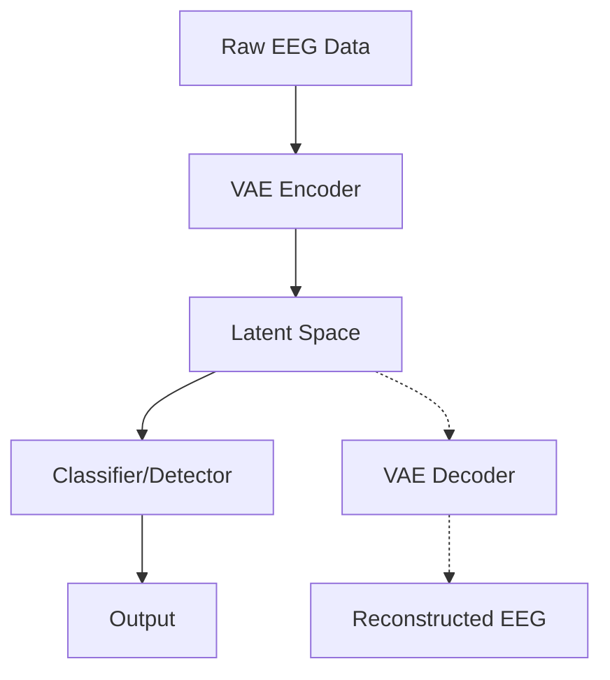

## Understand the dataset the format and the nature to work further 


## Things to do now 
- [ ]  Find feature extraction techniques 
- [ ] Run the basic file format in MNE 


I want to create a project give me a proper pipeline of how to proceed the project fill the necessary details in between if you feel so 

Emotion classification using DENS dataset EEG for emotion recognition (Variance arousal dominance) in the VAD space 


File format - FDt
Libraries - 
- torch
- Mne
- pytorch-lightning 


Steps- 
Feature extraction - with the help of LSTM and autoencoders ( both parallel or sequential )

Perform regularisation and normalisation in EEG 

Models to use - Inception v3 + Unit

Optimisation techniques - 
- ACO 
- GWO
- ADAM
- PSO

Metrics - 

AUC
Performance Recall score 
F1 score 
Confusion matrix 


feature extraction ki techniques konsi use kar sakte ho ( use LSTM or Autoencoder parallel or seqeuential )
regularisation and normalisation 

model kon kon se lagane hai - Inception V3 + Unit 


LSTM + inceptions alag results denge 
Comparision baseline ke liye paper ke models 


optimisation ppe dhyaan dena hai 
- ACO 
- Grey Wolf
- Adam
- PSO


Results kya chahiye 
-
Feature ex
regul + norm
AUC curve
PR curve 
Confusion matrix


latent space cannot be applied 
ICA cannot be used here 


LDA can only be used 


QDA

feature vector nikalna aasan rehta hai compared to it 


# EEG 


We can combine the Use of VAE just fine tuned for our EEG tasks and then perform compression on them 


This compression later then derrives the later features and then uses CNNs or similar architecture to identify a type of a





Potential architectures:

- VAE + CNN: Use a convolutional neural network for classification on the latent space.
- VAE + LSTM: Capture temporal dependencies in the latent representations.
- VAE + Attention mechanisms: Focus on the most relevant parts of the latent space.


Considerations:

- Balancing reconstruction vs. classification loss
- Choosing an appropriate latent space dimension
- Regularization to prevent overfitting


Sudhakar Mishra IIT Kanpur For BCI and EEG 

- [ ] Dataset kya hoga  - https://www.biorxiv.org/content/10.1101/2021.08.04.455041v1
- [ ] Method/Model - CNN + LSTM + Vad fuzzy model 
- [ ] Heatmap of EEG

## Paper Details 


The paper titled "Deep Fuzzy Framework for Emotion Recognition using EEG Signals and Emotion Representation in Type-2 Fuzzy VAD Space" presents a novel approach to emotion recognition using EEG signals. Here are the key details:

1. Main Objective:
The study aims to develop a generic model for representing emotions using a fuzzy Valence-Arousal-Dominance (VAD) space and improve emotion recognition by integrating this representation with EEG data.

2. Dataset:
- The study uses the DENS (Dataset on Emotions using Naturalistic Stimuli) dataset.
- It includes EEG recordings from 40 participants watching emotionally evocative films.
- The dataset covers 24 distinct emotions with 465 emotional events.

3. Methodology:
a) Data Preparation:
   - EEG signal preprocessing: bandpass filtering (1-40 Hz), segmentation, ICA for artifact removal.
   - Feature extraction: Short-Time Fourier Transform (STFT) for spectrograms.

b) Deep Fuzzy Framework:
   - Three main modules: Spatial (CNN), Temporal (LSTM), and Fuzzy VAD representation.
   - Three models based on different fuzzy representations:
     i) Model-1: Type-2 fuzzy membership
     ii) Model-2: Unsupervised fuzzy clusters
     iii) Model-3: Cuboid probabilistic lattice representation

c) Architecture:
   - CNN layers for spatial features
   - LSTM layers for temporal features
   - Integration of fuzzy VAD representation

4. Key Innovations:
- Use of type-2 fuzzy logic to represent emotions in VAD space.
- Integration of fuzzy VAD representation with EEG features.
- Handling a large number of emotion classes (24) simultaneously.

5. Results:
- Model-1 (Type-2 Fuzzy Membership) achieved the highest accuracy of 96.09%
- Model-3 (Cuboid Probabilistic Lattice) achieved 95.75% accuracy
- Model-2 (Unsupervised Fuzzy Clusters) achieved 95.31% accuracy
- Cross-subject emotion recognition achieved up to 78.37% accuracy

6. Ablation Study:
- Without VAD space: 93.54% accuracy
- With crisp VAD space: 95.01% accuracy
- Demonstrating the effectiveness of the fuzzy VAD representation

7. Significance:
- The model shows good performance in cross-subject scenarios, indicating potential for real-world applications.
- The approach addresses the complexity and subjectivity of emotions by using fuzzy logic.
- It combines physiological data (EEG) with subjective ratings (VAD) for a more comprehensive emotion recognition system.

8. Future Directions:
- Adaptation to different cultural contexts
- Integration of additional modalities for more comprehensive emotion understanding


1. Dataset (DENS) Details:
- 40 participants (mean age: 23.3 ± 1.25, F=3)
- Used naturalistic stimuli (emotional films)
- Each participant exposed to 9 emotional and 2 non-emotional stimuli
- 60-second duration for each stimulus
- Participants clicked when experiencing an emotion (Emotional Event)
- 465 total emotional experiences recorded
- 24 distinct emotion labels

2. EEG Recording and Preprocessing:
- Sampling rate: 250 Hz
- 7-second segment analyzed for each emotional event
- Preprocessing steps:
  - Average re-referencing
  - Bandpass filtering (1-40 Hz, 5th order Butterworth)
  - Independent Component Analysis (ICA) for artifact removal
  - ICLabel tool used for component categorization

3. Feature Extraction:
- Short-Time Fourier Transform (STFT) used
- 50% overlapping in STFT computation
- Spectrograms computed and stacked for input

4. Deep Learning Architecture:
a) Spatial Module:
   - Two CNN layers
   - Max pooling and ReLU activation
   - 20% dropout rate
   - 32 and 64 kernels for first and second CNN layers

b) Temporal Module:
   - Two LSTM layers
   - Repeat Sequence operation (R=4) before LSTM

c) Fuzzy Module:
   - Fuzzifier sub-module
   - Model Selector
   - Fully Connected neural network

5. Fuzzy Representations:
a) Model-1 (Type-2 Fuzzy):
   - Uses type-2 fuzzy membership functions
   - Upper and Lower Membership Functions defined

b) Model-2 (Unsupervised Fuzzy Clusters):
   - Based on Fuzzy C-Means (FCM) algorithm
   - Optimal number of clusters determined using fuzzy silhouette index

c) Model-3 (Cuboid Probabilistic Lattice):
   - Uses type-2 fuzzy membership
   - Dual output: 24 emotions and 27 VAD space classes

6. Cross-Subject Study:
- Emotions grouped into three categories for simplification
- Training and validation sets use data from different participants

7. Results Analysis:
- Model-1 performance: 96.09% accuracy
- Model-2 performance: 95.31% accuracy (with 4 clusters)
- Model-3 performance: 95.75% accuracy
- Cross-subject accuracy: up to 78.37%

8. Ablation Study Results:
- Without fuzzy framework (crisp VAD): 95.01% accuracy
- Without any VAD values: 93.54% accuracy
- UMF as Type-1 Fuzzy: 95.82% accuracy
- LMF as Type-1 Fuzzy: 94.65% accuracy

9. Theoretical Insights:
- Discussion on the importance of Dominance dimension in emotion representation
- Analysis of emotion distribution in VAD space using Fuzzy C-Means clustering

10. Computational Details:
- Use of ReLU activation functions
- Softmax used in the final layer of Model-3
- Detailed equations provided for various computational steps

11. Limitations and Future Work:
- Need for adaptation to different cultural contexts
- Potential for integrating additional modalities

## Fuzzy logic - 

Certainly. In this research, fuzzy logic is used to address the inherent complexity and subjectivity of emotions. Here's a breakdown of what fuzzy means in this context and how it's helping the research:

1. Fuzzy Logic in Emotion Representation:

Instead of using crisp, definite values to represent emotions in the Valence-Arousal-Dominance (VAD) space, fuzzy logic allows for degrees of membership to different emotional states. This means an emotion can belong to multiple categories to varying degrees, rather than fitting into a single, discrete category.

2. Type-2 Fuzzy Sets:

The research uses type-2 fuzzy sets, which provide two levels of fuzziness:
- Upper Membership Function (UMF): Represents a general understanding of emotions.
- Lower Membership Function (LMF): Based on population-specific data.

This dual representation allows the model to account for both universal and culturally/individually specific aspects of emotion.

3. Handling Uncertainty and Subjectivity:

Emotions are often ambiguous and subjective. Fuzzy logic helps by:
- Allowing for mixed emotions (e.g., bittersweet feelings)
- Representing gradual transitions between emotional states
- Accounting for individual differences in emotional expression and interpretation

4. Improving Emotion Recognition:

By integrating fuzzy representations with EEG data, the research aims to create a more nuanced and accurate emotion recognition system. This is evident in the high accuracy (96.09%) achieved for classifying 24 distinct emotions.

5. Enhancing Cross-Subject Performance:

The fuzzy approach helps in generalizing emotion recognition across different individuals. The research shows improved cross-subject accuracy (up to 78.37%) when using the fuzzy framework.

6. Bridging Subjective Ratings and Physiological Data:

Fuzzy logic helps in combining subjective VAD ratings with objective EEG data, providing a more comprehensive representation of emotional states.

7. Handling Complex Emotion Space:

The research deals with 24 distinct emotions, which is unusually high for this type of study. Fuzzy logic helps in managing this complex emotion space by allowing for overlapping and gradient representations.

8. Adapting to Individual Variations:

The fuzzy approach allows the model to be more flexible in interpreting emotional responses, potentially adapting better to individual differences in emotional expression.

9. Improving Model Generalizability:

By using fuzzy representations, the model becomes more adaptable to different contexts and individuals, potentially improving its real-world applicability.

10. Enhancing Interpretability:

Fuzzy logic can provide more intuitive and interpretable results, as it mirrors the way humans often think about emotions (e.g., feeling "somewhat happy" rather than "happy to exactly degree X").

In summary, fuzzy logic in this research is helping to create a more flexible, nuanced, and potentially more accurate model of emotion recognition. It's addressing the challenges of subjectivity and complexity in emotions, allowing for a richer representation that can capture the subtle variations in human emotional experiences. This approach is particularly valuable when dealing with a large number of emotion categories and when aiming for cross-subject applicability.


## Fuzzy vs VAE 

That's an interesting question. Whether you can replace a fuzzy algorithm with a Variational Autoencoder (VAE) depends on the specific application and requirements. Let's explore this idea:

1. Problem nature:
   - Fuzzy algorithms are typically used for decision-making or control systems where rules can be explicitly defined.
   - VAEs are better suited for generative tasks and dealing with high-dimensional data.

2. Data availability:
   - Fuzzy algorithms often rely on expert knowledge and don't necessarily require large datasets.
   - VAEs need substantial amounts of data to train effectively.

3. Interpretability:
   - Fuzzy algorithms offer clear interpretability through their rule-based structure.
   - VAEs are generally less interpretable, functioning more like a "black box".

4. Uncertainty handling:
   - Both handle uncertainty, but in different ways. Fuzzy algorithms use membership functions, while VAEs use probabilistic distributions.

5. Computational requirements:
   - VAEs typically require more computational resources for training and inference.
   - Fuzzy algorithms are often less computationally intensive.

In some cases, you might be able to replace a fuzzy algorithm with a VAE, particularly if:

1. You have a large dataset available.
2. The problem involves complex, high-dimensional data.
3. You're more interested in generating new data or finding latent representations than in explicit rule-based decision making.
4. Interpretability is less critical than performance.

However, it's not a straightforward replacement. You'd likely need to reformulate the problem to fit the VAE paradigm.

For example, if you're using a fuzzy algorithm for control systems, a direct replacement with a VAE might not be appropriate. But if you're using fuzzy logic for pattern recognition or classification, a VAE might be able to capture more complex patterns in the data.


## Now using EEG 


Thank you for providing that context. It's an interesting paper that combines deep learning techniques with fuzzy logic for emotion recognition. Let's analyze the possibility of replacing the fuzzy algorithm components with VAEs:

1. Current approach:
   The paper uses a deep fuzzy framework that combines:
   - Deep learning for feature extraction from EEG signals
   - Type-2 fuzzy logic for emotion representation in VAD space
   - Fuzzy rules for emotion classification

2. Potential VAE replacement:
   We could consider replacing parts of this system with VAEs, but it would significantly change the approach and potentially the interpretability of the results. Here's how we might approach it:

   a) Feature extraction:
      - Keep the deep learning component for EEG feature extraction.
      
   b) Emotion representation:
      - Instead of using Type-2 fuzzy VAD space, we could train a VAE to learn a latent representation of emotions.
      - The latent space of the VAE could potentially capture the Valence-Arousal-Dominance dimensions implicitly.

   c) Emotion classification:
      - Rather than using fuzzy rules, we could use the latent representations from the VAE for classification.
      - This could be done by adding a classification layer after the VAE encoder or by using the latent representations as input to a separate classifier.

3. Considerations:

   a) Data requirements:
      - VAEs typically require larger datasets. Ensure you have sufficient EEG data paired with emotion labels.

   b) Interpretability:
      - The fuzzy VAD space in the original paper offers clear interpretability.
      - A VAE-based approach might lose some of this interpretability, as the latent space dimensions may not directly correspond to V-A-D.

   c) Uncertainty handling:
      - VAEs can handle uncertainty, but differently from fuzzy logic.
      - You'd need to carefully consider how to represent and utilize uncertainty in emotion recognition.

   d) Performance:
      - VAEs might capture more complex patterns in the data, potentially improving recognition accuracy.
      - However, this would need to be empirically verified.

   e) Continuous vs. discrete emotions:
      - If the original system deals with discrete emotion categories, you'd need to adapt the VAE approach to handle this.

4. Proposed approach:
   You could consider a hybrid approach:
   - Use a VAE to learn latent representations of EEG signals and emotions.
   - Map the VAE's latent space to a fuzzy VAD space.
   - Use fuzzy rules or another classification method on this mapped space.

This approach would leverage the VAE's ability to capture complex patterns while maintaining some of the interpretability of the fuzzy VAD space.

## Methodology 

Certainly. I'll outline a step-by-step methodology for implementing the hybrid VAE-Fuzzy approach for emotion recognition using EEG signals, and then provide guidance on implementing it in PyTorch.

Methodology:

1. Data Preparation:
   - Preprocess EEG signals
   - Encode emotion labels (if using discrete emotions)

2. VAE Architecture Design:
   - Design encoder network
   - Design decoder network
   - Define latent space dimensions

3. VAE Training:
   - Train VAE on EEG data
   - Fine-tune to capture emotion-related features

4. Latent Space Mapping:
   - Map VAE latent space to fuzzy VAD space
   - Define membership functions for V, A, D dimensions

5. Fuzzy Rule Definition:
   - Define fuzzy rules for emotion classification based on VAD space

6. Classification:
   - Use fuzzy inference on mapped latent representations for final classification

7. Evaluation:
   - Compare performance with original deep fuzzy framework

Now, let's implement this in PyTorch:


```python
import torch
import torch.nn as nn
import torch.nn.functional as F
from torch.utils.data import DataLoader, TensorDataset

# 1. Data Preparation (assuming you have preprocessed EEG data)
# X: EEG data tensor, y: emotion labels tensor
X = torch.randn(1000, 64, 128)  # Example: 1000 samples, 64 channels, 128 time points
y = torch.randint(0, 7, (1000,))  # Example: 7 emotion classes

# 2. VAE Architecture
class VAE(nn.Module):
    def __init__(self, input_dim, hidden_dim, latent_dim):
        super(VAE, self).__init__()
        self.encoder = nn.Sequential(
            nn.Linear(input_dim, hidden_dim),
            nn.ReLU(),
            nn.Linear(hidden_dim, hidden_dim),
            nn.ReLU()
        )
        self.fc_mu = nn.Linear(hidden_dim, latent_dim)
        self.fc_var = nn.Linear(hidden_dim, latent_dim)
        
        self.decoder = nn.Sequential(
            nn.Linear(latent_dim, hidden_dim),
            nn.ReLU(),
            nn.Linear(hidden_dim, hidden_dim),
            nn.ReLU(),
            nn.Linear(hidden_dim, input_dim)
        )
    
    def encode(self, x):
        h = self.encoder(x)
        return self.fc_mu(h), self.fc_var(h)
    
    def reparameterize(self, mu, log_var):
        std = torch.exp(0.5 * log_var)
        eps = torch.randn_like(std)
        return mu + eps * std
    
    def decode(self, z):
        return self.decoder(z)
    
    def forward(self, x):
        mu, log_var = self.encode(x.view(x.size(0), -1))
        z = self.reparameterize(mu, log_var)
        return self.decode(z), mu, log_var

# 3. VAE Training
def vae_loss(recon_x, x, mu, log_var):
    BCE = F.binary_cross_entropy(recon_x, x.view(-1, 784), reduction='sum')
    KLD = -0.5 * torch.sum(1 + log_var - mu.pow(2) - log_var.exp())
    return BCE + KLD

input_dim = 64 * 128
hidden_dim = 256
latent_dim = 20
vae = VAE(input_dim, hidden_dim, latent_dim)
optimizer = torch.optim.Adam(vae.parameters())

# Training loop (simplified)
for epoch in range(100):
    for batch_idx, (data, _) in enumerate(DataLoader(TensorDataset(X, y), batch_size=32, shuffle=True)):
        optimizer.zero_grad()
        recon_batch, mu, log_var = vae(data)
        loss = vae_loss(recon_batch, data, mu, log_var)
        loss.backward()
        optimizer.step()

# 4. Latent Space Mapping
class FuzzyVADMapping(nn.Module):
    def __init__(self, latent_dim):
        super(FuzzyVADMapping, self).__init__()
        self.fc = nn.Linear(latent_dim, 3)  # 3 for V, A, D
    
    def forward(self, z):
        return torch.sigmoid(self.fc(z))  # Sigmoid to bound values between 0 and 1

vad_mapping = FuzzyVADMapping(latent_dim)

# 5. Fuzzy Rule Definition (simplified example)
def fuzzy_rules(vad):
    v, a, d = vad[:, 0], vad[:, 1], vad[:, 2]
    happy = torch.min(v, a)
    sad = torch.min(1 - v, 1 - a)
    angry = torch.min(1 - v, a)
    # Add more rules for other emotions
    return torch.stack([happy, sad, angry], dim=1)

# 6. Classification
def classify_emotions(eeg_data):
    vae.eval()
    with torch.no_grad():
        _, mu, _ = vae(eeg_data)
        vad = vad_mapping(mu)
        emotion_scores = fuzzy_rules(vad)
    return torch.argmax(emotion_scores, dim=1)

# 7. Evaluation
def evaluate(test_data, test_labels):
    predictions = classify_emotions(test_data)
    accuracy = (predictions == test_labels).float().mean()
    return accuracy.item()

# Example usage
test_accuracy = evaluate(X, y)
print(f"Test Accuracy: {test_accuracy:.4f}")

```

This implementation provides a basic structure for the VAE-Fuzzy hybrid approach. Here's a breakdown of the key components:

1. VAE Architecture: Implements a simple VAE with fully connected layers.
2. VAE Training: Includes the VAE loss function and a basic training loop.
3. Fuzzy VAD Mapping: Maps the VAE's latent space to a 3D VAD space.
4. Fuzzy Rules: A simplified example of fuzzy rules for emotion classification.
5. Classification: Combines the VAE, VAD mapping, and fuzzy rules for emotion prediction.
6. Evaluation: A basic accuracy calculation.

To improve and adapt this implementation:

1. Adjust the VAE architecture to better suit your EEG data (e.g., using convolutional layers).
2. Implement more sophisticated fuzzy rules based on psychological models of emotion.
3. Add regularization and fine-tuning steps to improve emotion-related feature extraction.
4. Implement a more comprehensive evaluation, including confusion matrices and F1 scores.
5. Consider using attention mechanisms to focus on relevant EEG features.

Would you like me to elaborate on any specific part of this implementation or discuss how to further refine it for your specific EEG data and emotion recognition task?

## Pytorch Lightning 

```python 
import torch
import torch.nn as nn
import torch.nn.functional as F
from torch.utils.data import DataLoader, TensorDataset
import pytorch_lightning as pl

class VAE(nn.Module):
    def __init__(self, input_dim, hidden_dim, latent_dim):
        super(VAE, self).__init__()
        self.encoder = nn.Sequential(
            nn.Linear(input_dim, hidden_dim),
            nn.ReLU(),
            nn.Linear(hidden_dim, hidden_dim),
            nn.ReLU()
        )
        self.fc_mu = nn.Linear(hidden_dim, latent_dim)
        self.fc_var = nn.Linear(hidden_dim, latent_dim)
        
        self.decoder = nn.Sequential(
            nn.Linear(latent_dim, hidden_dim),
            nn.ReLU(),
            nn.Linear(hidden_dim, hidden_dim),
            nn.ReLU(),
            nn.Linear(hidden_dim, input_dim)
        )
    
    def encode(self, x):
        h = self.encoder(x)
        return self.fc_mu(h), self.fc_var(h)
    
    def reparameterize(self, mu, log_var):
        std = torch.exp(0.5 * log_var)
        eps = torch.randn_like(std)
        return mu + eps * std
    
    def decode(self, z):
        return self.decoder(z)
    
    def forward(self, x):
        mu, log_var = self.encode(x.view(x.size(0), -1))
        z = self.reparameterize(mu, log_var)
        return self.decode(z), mu, log_var

class FuzzyVADMapping(nn.Module):
    def __init__(self, latent_dim):
        super(FuzzyVADMapping, self).__init__()
        self.fc = nn.Linear(latent_dim, 3)  # 3 for V, A, D
    
    def forward(self, z):
        return torch.sigmoid(self.fc(z))  # Sigmoid to bound values between 0 and 1

def fuzzy_rules(vad):
    v, a, d = vad[:, 0], vad[:, 1], vad[:, 2]
    happy = torch.min(v, a)
    sad = torch.min(1 - v, 1 - a)
    angry = torch.min(1 - v, a)
    # Add more rules for other emotions
    return torch.stack([happy, sad, angry], dim=1)

class VAEFuzzyEmotionRecognition(pl.LightningModule):
    def __init__(self, input_dim, hidden_dim, latent_dim, num_emotions):
        super(VAEFuzzyEmotionRecognition, self).__init__()
        self.save_hyperparameters()
        self.vae = VAE(input_dim, hidden_dim, latent_dim)
        self.vad_mapping = FuzzyVADMapping(latent_dim)
        self.num_emotions = num_emotions

    def forward(self, x):
        recon_x, mu, log_var = self.vae(x)
        vad = self.vad_mapping(mu)
        emotion_scores = fuzzy_rules(vad)
        return recon_x, mu, log_var, emotion_scores

    def training_step(self, batch, batch_idx):
        x, y = batch
        recon_x, mu, log_var, emotion_scores = self(x)
        
        # VAE loss
        recon_loss = F.mse_loss(recon_x, x.view(x.size(0), -1), reduction='sum')
        kl_loss = -0.5 * torch.sum(1 + log_var - mu.pow(2) - log_var.exp())
        vae_loss = recon_loss + kl_loss
        
        # Emotion classification loss
        class_loss = F.cross_entropy(emotion_scores, y)
        
        total_loss = vae_loss + class_loss
        
        self.log('train_loss', total_loss)
        return total_loss

    def validation_step(self, batch, batch_idx):
        x, y = batch
        recon_x, mu, log_var, emotion_scores = self(x)
        
        # VAE loss
        recon_loss = F.mse_loss(recon_x, x.view(x.size(0), -1), reduction='sum')
        kl_loss = -0.5 * torch.sum(1 + log_var - mu.pow(2) - log_var.exp())
        vae_loss = recon_loss + kl_loss
        
        # Emotion classification loss
        class_loss = F.cross_entropy(emotion_scores, y)
        
        total_loss = vae_loss + class_loss
        
        # Calculate accuracy
        pred = emotion_scores.argmax(dim=1)
        acc = (pred == y).float().mean()
        
        self.log('val_loss', total_loss)
        self.log('val_acc', acc)

    def configure_optimizers(self):
        return torch.optim.Adam(self.parameters(), lr=1e-3)

# Data preparation (assuming you have preprocessed EEG data)
X = torch.randn(1000, 64, 128)  # Example: 1000 samples, 64 channels, 128 time points
y = torch.randint(0, 7, (1000,))  # Example: 7 emotion classes

train_dataset = TensorDataset(X[:800], y[:800])
val_dataset = TensorDataset(X[800:], y[800:])

train_loader = DataLoader(train_dataset, batch_size=32, shuffle=True)
val_loader = DataLoader(val_dataset, batch_size=32)

# Model initialization and training
input_dim = 64 * 128
hidden_dim = 256
latent_dim = 20
num_emotions = 7

model = VAEFuzzyEmotionRecognition(input_dim, hidden_dim, latent_dim, num_emotions)

trainer = pl.Trainer(max_epochs=100, gpus=1 if torch.cuda.is_available() else 0)
trainer.fit(model, train_loader, val_loader)

# Evaluation
trainer.test(model, val_loader)

# Example of using the trained model for prediction
def predict_emotion(eeg_data):
    model.eval()
    with torch.no_grad():
        _, _, _, emotion_scores = model(eeg_data)
    return emotion_scores.argmax(dim=1)

# Example usage
test_data = torch.randn(10, 64, 128)  # 10 test samples
predictions = predict_emotion(test_data)
print("Predicted emotions:", predictions)
```


## LLM hirable enough 

All llms do is add vectors 
One directional cosines for common words 

Nouns have very high range of vector so we scale that down 

Try classifying vectors 
Images are GNN 

Differernt to LLM  - Language is the key term 